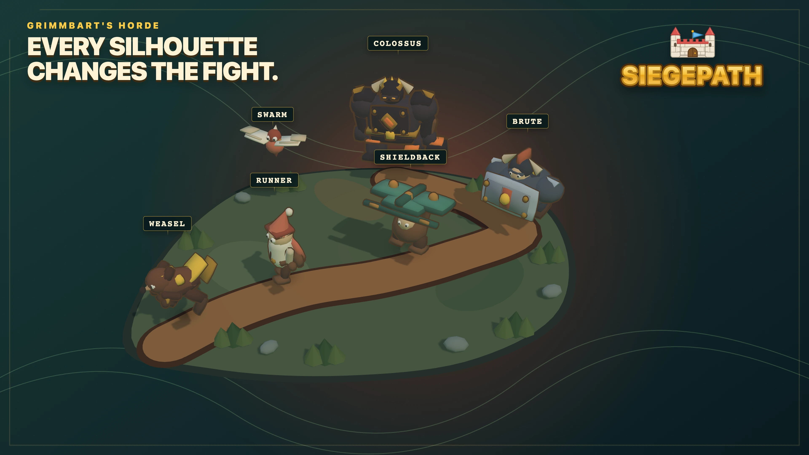
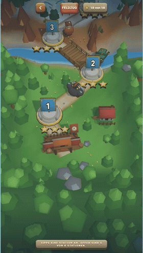
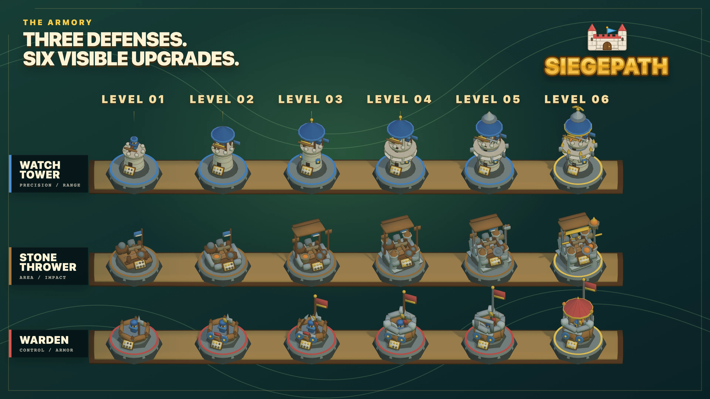

  

# SIEGEPATH

**Build the defense. Read the path. Hold the line.**

SIEGEPATH is a mobile-first 2.5D tower-defense strategy game for the browser, built with Three.js.

Defend your castle across a stylized miniature world, place the right defenses along winding routes and adapt before the next wave reaches the gate. Every map asks you to balance positioning, upgrades and limited gold against enemies with very different strengths.

## The game

- Defend the castle through ten escalating campaign waves.
- Build and upgrade three distinct defense types across six handcrafted maps.
- Read each incoming wave and counter fast runners, armored units, swarms and bosses.
- Earn stars, unlock new routes and improve your best result on every map.
- Continue beyond the campaign in Endless mode or face Grimmbart in Duel mode.
- Experience a colorful low-poly world with real-time effects, music and tactile battle sounds.

## Designed for mobile

SIEGEPATH is designed around short, readable interactions on touch screens while retaining the positioning and planning of a compact strategy game. Maps, units, towers, effects and the animated world are rendered in real time with Three.js.

## Six maps. One long road to the castle.

The campaign climbs through six distinct battlefields. Every stop introduces a new route, new pressure and a fully rated three-star challenge.

  

**[Watch the full-quality campaign journey (MP4)](assets/siegepath-level-journey.mp4)**

## Three defenses. Six visible upgrades.

Watchtower, Stone Thrower and Warden each grow through six readable silhouettes. Their models evolve with every upgrade so strength is visible directly on the battlefield.

  

## Development status

SIEGEPATH is currently in active development. Mechanics, balancing and presentation are still evolving.

This repository is the public project showcase. The source code and internal development history remain private.
